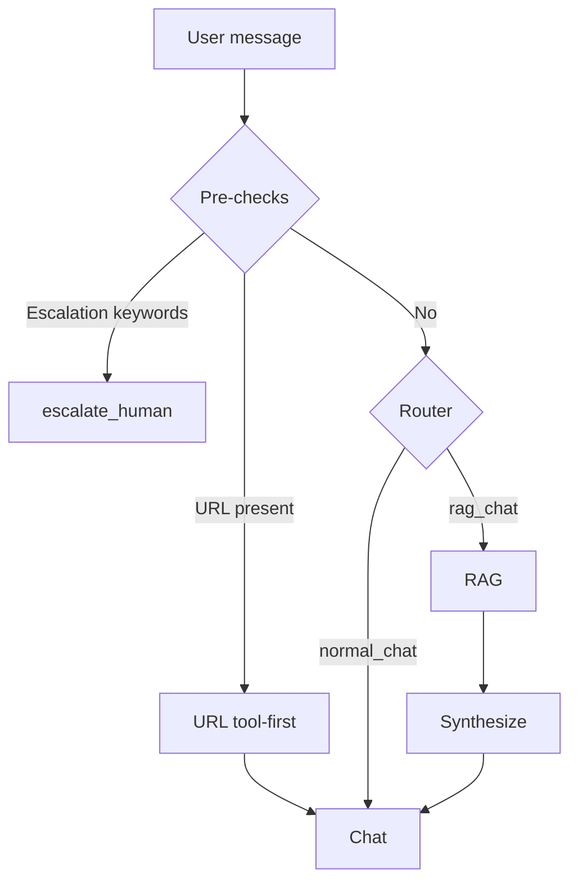

# langgraph-design-patterns

  
  
  
  
  

 

  

> Practical LangGraph patterns for routing, reliable tool calling, memory, and cost-aware workflows.

  

## What you’ll learn (fast)
 

- Readable `StateGraph` fundamentals (state → nodes → edges → compile).
- Clean patterns for LLM nodes and tools (where each belongs in a project).
- Routing that avoids slow-by-default RAG (prechecks → router LLM → conditional edges).
- Conditional RAG branches (retrieve only when the route is `rag_chat`).
- Memory done right: short-term threads/checkpoints vs long-term user facts (store).
- Context window control (trim + summarize) to keep prompts small and stable.

## Architecture overview (mental model)

## Start here
 

1.  [00 — Hello StateGraph](examples/00-hello-stategraph/README.md) — Learn state → nodes → edges → compile
2.  [Router decision table](decision-guides/router-decision-table.md) — Pick routes consistently (chat vs RAG vs escalation)
3.  [Deterministic overrides](patterns/04-deterministic-overrides-regex-keywords.md) — Add URL + escalation prechecks before any LLM
4.  [Short-term memory](patterns/05-short-term-memory-checkpointers-thread-id.md) — Use `thread_id` + checkpoints to resume safely

## Quick navigation

### Decision guides (tell me what to do)
 

- [Router decision table](decision-guides/router-decision-table.md) — pick routes fast and consistently.
- [Memory decision table](decision-guides/memory-decision-table.md) — choose checkpointing vs long-term store (keying + retention).
- [Deterministic vs LLM decision table](decision-guides/deterministic-vs-llm-decision-table.md) — decide what must be deterministic vs model-driven.

### Patterns (one idea per page)
 

1. [Repo structure & separation of concerns](patterns/01-repo-structure-separation-of-concerns.md) — keep nodes/tools/routes decoupled.
2. [Routing: chat vs RAG vs escalation](patterns/02-routing-chat-vs-rag-vs-escalation.md) — route early, keep RAG off the happy path.
3. [Tool-calling contracts & reliability](patterns/03-tool-calling-contracts-and-reliability.md) — tool contracts that don’t break at runtime.
4. [Deterministic overrides (regex + keywords)](patterns/04-deterministic-overrides-regex-keywords.md) — guarantees for URLs and escalation.
5. [Short-term memory (checkpointers + thread_id)](patterns/05-short-term-memory-checkpointers-thread-id.md) — resumable runs with bounded state.
6. [Long-term memory (store + namespace + key)](patterns/06-long-term-memory-store-namespace-key.md) — durable facts with clean keying.
7. [Context window control (trim + summarize)](patterns/07-context-window-trim-summarize.md) — keep prompts small and accurate.
8. [Latency & token budgeting](patterns/08-latency-token-budgeting.md) — budgets per step (router/retrieval/draft).
9. [Retries, fallbacks, and guards](patterns/09-retries-fallbacks-guards.md) — survive flaky tools and invalid outputs.
10. [Multi-node orchestration (state + edges)](patterns/10-multi-node-orchestration.md) — orchestrate stages without spaghetti edges.

## Cookbook (example milestones)
Each example is a milestone. Open its README for a guided walkthrough.

| Progress | Example | Covers |
|---|---|---|
|   | [00 — Hello StateGraph](examples/00-hello-stategraph/README.md) | state → nodes → edges → compile |
|    | [01 — One LLM call](examples/01-llm-call/README.md) | `get_llm()` + one clean LLM node |
|   | [02 — Tools basics](examples/02-tools-basics/README.md) | tool definition → tool call → answer with tool output |
|    | [03 — Router](examples/03-router/README.md) | deterministic checks → router LLM → conditional edges |
|   | [03b — RAG branch](examples/03b-rag-branch/README.md) | retrieve only when the route is `rag_chat` |
|   | [04 — Short-term memory](examples/04-short-term-memory/README.md) | `InMemorySaver` + `thread_id` |
|   | [05 — Long-term memory store](examples/05-long-term-memory-store/README.md) | `InMemoryStore` facts + recall (prod note included) |
|   | [06 — Context window summarize](examples/06-context-window-summarize/README.md) | trim + summarize |
|   | [07 — Capstone support agent](examples/07-capstone-support-agent/README.md) | router + tools + short-term + long-term + summary (ReAct-like note included) |

## Contributing
- See [CONTRIBUTING.md](CONTRIBUTING.md).

## License
MIT (see [LICENSE](LICENSE)).
