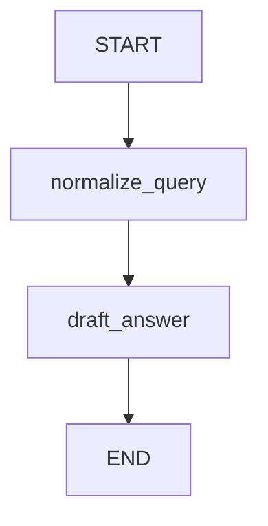

# 00 — Hello StateGraph (smallest possible graph)

Progress: ★☆☆☆☆☆☆☆☆

 

## Goal
Learn the three building blocks of a LangGraph workflow:
1) a **state contract** (what data exists),
2) **nodes** (functions that read/write state),
3) **edges** (the order of execution).

## Flow

## Files
| File | What it contains |
|---|---|
| `state.py` | the state keys (your contract) |
| `nodes.py` | two tiny node functions |
| `graph.py` | the wiring + `compile()` |

## File walkthrough order
1) `state.py`
2) `nodes.py`
3) `graph.py`

## Unlocked
- You can read a `StateGraph` top-to-bottom.
- You understand “nodes return partial state updates”.

---

