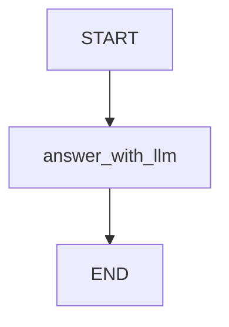

# 01 — One LLM call (the cleanest “LLM node”)

Progress: ★★☆☆☆☆☆☆☆

 

## Goal
Put *all* LLM setup in one place (`get_llm()`), then call it from a node.

## Flow

## Files
| File | What it contains |
|---|---|
| `llm.py` | `get_llm()` (OpenAI model config) |
| `state.py` | minimal state (`user_query`, `answer`) |
| `nodes.py` | one node that calls the LLM |
| `graph.py` | wiring + `compile()` |

## File walkthrough order
1) `state.py`
2) `llm.py`
3) `nodes.py`
4) `graph.py`

## Notes
- Set `OPENAI_API_KEY` in your environment.
- Optional: set `OPENAI_MODEL` (defaults to `gpt-4.1-mini`).

## Unlocked
- You know where to put “LLM configuration” vs “graph logic”.

---

