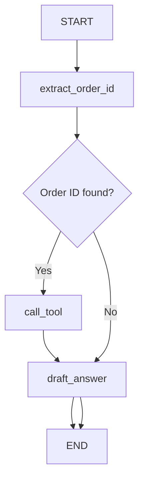

# 02 — Tools basics (define a tool, call it, then answer)

Progress: ★★★☆☆☆☆☆☆

 

## Goal
Learn the simplest “tools” pattern:
- define a tool in `tools.py`
- call it from a node
- store the result in state
- use the result when drafting an answer

## Flow

## Files
| File | What it contains |
|---|---|
| `tools.py` | a single tool: `lookup_order` |
| `llm.py` | `get_llm()` (OpenAI) |
| `state.py` | state keys (`user_query`, `order_id`, `order_info`, `answer`) |
| `nodes.py` | extract → call tool → draft |
| `graph.py` | conditional edge to skip tool when not needed |

## File walkthrough order
1) `state.py`
2) `tools.py`
3) `llm.py`
4) `nodes.py`
5) `graph.py`

## Production note (keep it simple here)
In real apps you’ll typically call tools via an agent loop.
For learning, explicit tool calls are easier to read.

## Unlocked
- “Tool definition” vs “tool invocation” vs “LLM drafting”.

---

