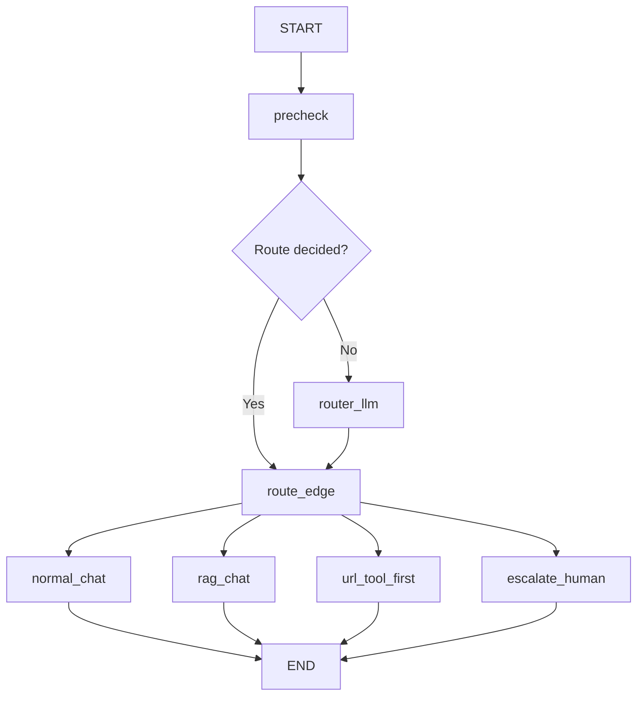

# 03 — Router (deterministic checks → router LLM → conditional edges)

Progress: ★★★★☆☆☆☆☆

 

## Goal
Learn the clean “router” structure used in most real LangGraph apps:
1) cheap deterministic checks (URL + escalation keywords)
2) router LLM only when needed
3) `add_conditional_edges` to pick the next node

## Flow

## What this example is (and isn’t)
- This is a router + wiring demo.
- The `rag_chat` node is intentionally a placeholder (we’ll build a full capstone later).

## File walkthrough order
1) `state.py`
2) `llm.py`
3) `nodes.py`
4) `graph.py`

## Unlocked
- You can save tokens by skipping the router LLM on obvious cases.
- You can keep route labels boring and stable.

---

