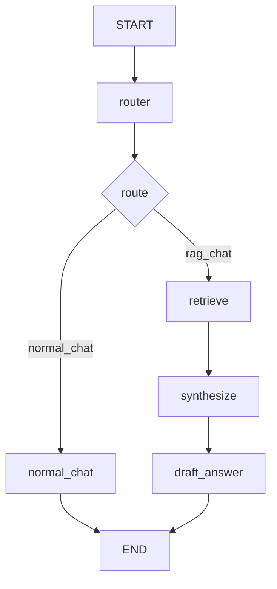

# 03b — RAG branch (retrieve only when route is `rag_chat`)

Progress: ★★★★★☆☆☆☆

 

## Goal
Add a RAG branch without making your app slow-by-default:
- route first (`normal_chat` vs `rag_chat`)
- retrieve **only** on `rag_chat`
- draft using retrieved docs

## Flow

## Files
| File | What it contains |
|---|---|
| `state.py` | state keys for RAG |
| `llm.py` | router model + drafting model |
| `nodes.py` | router → retrieve → synthesize → draft |
| `graph.py` | conditional edges for the RAG branch |

## File walkthrough order
1) `state.py`
2) `llm.py`
3) `nodes.py`
4) `graph.py`

## Unlocked
- You can keep retrieval off the “happy path”.
- You can design a RAG path as normal nodes (no magic).

---

