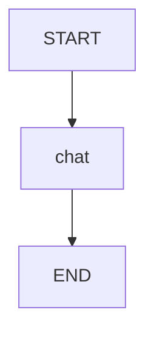

# 04 — Short-term memory (threads + checkpointing)

Progress: ★★★★★★☆☆☆

 -2563eb)

## Goal
Learn “short-term memory” in LangGraph:
- you keep conversation state in the graph
- you use a **checkpointer** so runs can be resumed per `thread_id`

## Key idea
Short-term memory is for *resumable runs* and *debuggable state*, not for durable user facts.

## Flow


## How the caller passes `thread_id`
```python
app = build_graph()

# Thread 1
config = {"configurable": {"thread_id": "thread-1"}}
app.invoke({"messages": [...]}, config=config)

# Same thread later (resumes state)
app.invoke({"messages": [...]}, config=config)
```

## Unlocked
- You understand “thread = short-term memory boundary”.

## File walkthrough order
1) `state.py`
2) `llm.py`
3) `nodes.py`
4) `graph.py`

---
[](../../README.md)
[](../03b-rag-branch/README.md)
[](../05-long-term-memory-store/README.md)
