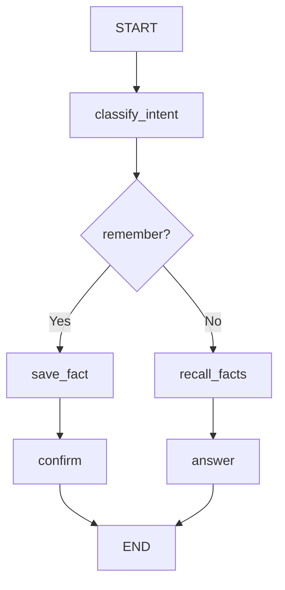

# 05 — Long-term memory (store facts with `InMemoryStore`)

Progress: ★★★★★★★☆☆

-2563eb) 

## Goal
Learn long-term memory using a **store**:
- write facts with `store.put(namespace, key, value)`
- recall facts with `store.search(namespace, query=..., limit=...)`

## Key idea
Long-term memory is for durable facts (preferences, profile, “remember this”).
It is not the same thing as conversation checkpointing.

## Flow


## Production note
This example uses `InMemoryStore` for clarity.
In production you’d use a persistent store (e.g., Postgres / Redis).

## How the caller passes `user_id` (context)
```python
app = build_graph()
config = {"configurable": {"user_id": "user-123"}}
app.invoke({"user_query": "Remember: I prefer email"}, config=config)
```

## File walkthrough order
1) `state.py`
2) `llm.py`
3) `nodes.py`
4) `graph.py`

## Unlocked
- You can separate “thread state” (short-term) from “facts store” (long-term).

---
[](../../README.md)
[](../04-short-term-memory/README.md)
[](../06-context-window-summarize/README.md)
