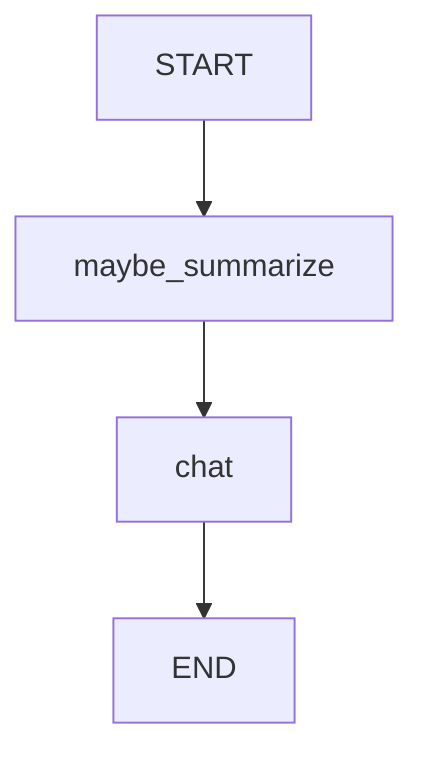

# 06 — Context window (trim + summarize)

Progress: ★★★★★★★★☆

 

## Goal
Keep prompts small as conversations grow:
- keep a rolling window of recent messages
- store an evolving `summary`

## Flow

## Unlocked
- You know where “summary” belongs (state) and when to update it.

## File walkthrough order
1) `state.py`
2) `llm.py`
3) `nodes.py`
4) `graph.py`

---

