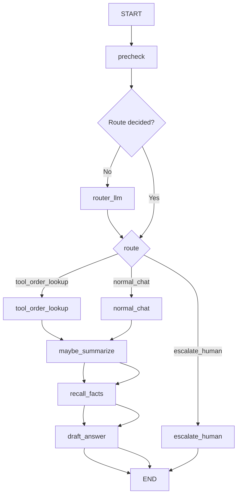

# 07 — Capstone: Support agent (router + tools + short-term + long-term + summary)

Progress: ★★★★★★★★★

 

## Goal
Combine the previous examples into one small “support agent” layout that feels like a real project:
- `state.py`: the contract
- `tools.py`: side-effectful utilities
- `nodes.py`: pure-ish steps that read/write state
- `graph.py`: routing + wiring + compile

## Flow (high level)


## “ReAct-like loop” note
This capstone is a *graph-first* implementation (explicit nodes + edges).
If you want a ReAct-style tool loop, use the modern `create_agent` approach (not deprecated `create_react_agent`)
and call it inside a node.

## How the caller passes `thread_id` (short-term) + `user_id` (long-term context)
```python
from langchain_core.messages import HumanMessage

app = build_graph()
config = {"configurable": {"thread_id": "thread-1", "user_id": "user-123"}}

app.invoke({"messages": [HumanMessage(content="Where is my order 12345?")]}, config=config)
```

## Unlocked (what you can now build)
- A readable “glue” layout users can reuse in `agents/`.
- A router that avoids unnecessary LLM calls.
- Short-term conversation memory (threads/checkpointing).
- Long-term facts (store) + recall.
- Context-window summarization.

## File walkthrough order
1) `state.py`
2) `tools.py`
3) `llm.py`
4) `nodes.py`
5) `graph.py`

---
[](../../README.md#cookbook-example-milestones)
[](../06-context-window-summarize/README.md)
[](../../README.md#cookbook-example-milestones)
