# Routing: chat vs RAG vs escalation

 

## Quick take
If you run retrieval for everything, your app becomes slow-by-default.
Route early into exactly three routes: `normal_chat`, `rag_chat`, `escalate_human` (plus a URL tool-first pre-check).

<p align="center">
  
</p>

## Route contract (keep it boring)
```text
route must be exactly one of:
- normal_chat
- rag_chat
- escalate_human

reason:
- 1 sentence (for logs/debugging)
```

## When to use
- Your users mix small talk, doc questions, and support requests.
- RAG latency/cost hurts UX (especially p95).
- You need predictable human handoff behavior.

## Avoid when
- Every query must be grounded (you’re always in `rag_chat`).
- You don’t have (or want) an escalation path.

## Flow (minimal)
```mermaid
flowchart TD
  U[User message] --> D{Pre-checks}
  D -->|Escalation keywords| H[escalate_human]
  D -->|URL present| T[URL tool-first]
  D -->|No| R{Router (small/fast)}
  R -->|normal_chat| C[normal_chat]
  R -->|rag_chat| G[rag_chat]
  T --> C
```

## Router prompt rules (starter)
- Output only the route enum + a short reason (no answering).
- Prefer `normal_chat` unless retrieval is clearly required.
- Choose `escalate_human` only for explicit human asks or dissatisfaction.
- If unsure, pick `normal_chat` and ask one clarifying question downstream.

## Failure modes
- Router becomes slow because you pass too much context (symptom: p95 spikes).
- `rag_chat` becomes default (symptom: retrieval runs on casual chat).
- Escalation keywords are too broad (symptom: false escalations).

## Checklist (copy/paste)
- [ ] Standardize routes (exact strings; validate them).
- [ ] Run deterministic pre-checks before routing (URL, escalation keywords).
- [ ] Log `route` + `reason` for every request.
- [ ] Keep router context bounded (current query or last 1–3 turns).
- [ ] Make `escalate_human` a handoff package (not an integration).

## Links
- Official docs:
  - https://langchain-ai.github.io/langgraph/
- Internal:
  - `decision-guides/router-decision-table.md`
  - `examples/03-router/README.md`

---
[](../README.md)
[](01-repo-structure-separation-of-concerns.md)
[](03-tool-calling-contracts-and-reliability.md)
