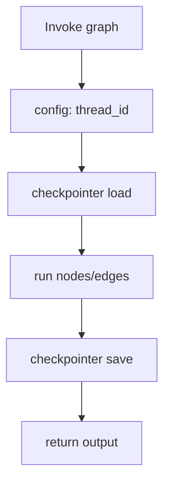

# Short-term memory (checkpointers + thread_id)

-2563eb) 

## Quick take
If a multi-step run restarts, you don’t want to redo tools or lose “where we were”.
Use a stable `thread_id` and checkpoint only the minimum state needed to resume.

## When to use
- Your workflow has multiple steps (router → tools → synthesis → draft).
- You care about resumability across retries/restarts.
- You want consistent “graph progress” per conversation.

## Avoid when
- Your workflow is single-step and always recomputable.
- You cannot store conversational state (policy constraints).

## Flow (minimal)


## What to checkpoint (keep it small)
- Bounded `messages` (last N turns, not the whole transcript).
- The last `route` + `reason` (for debugging and replay).
- Tool outputs needed for the next node (structured, size-capped).

```python
# Conceptual: a stable ID per conversation/session
config = {"configurable": {"thread_id": session_id}}
```

## Failure modes
- No retention plan (symptom: store grows forever).
- Checkpointing raw payloads (symptom: storage and prompts bloat).
- Unstable `thread_id` (symptom: “memory resets” between requests).

## Checklist (copy/paste)
- [ ] `thread_id` is stable per conversation.
- [ ] Checkpointed state is bounded (messages/tool outputs have caps).
- [ ] You can delete checkpoint data by `thread_id` (support + cleanup).
- [ ] Retention exists (age-based TTL and/or size limits).
- [ ] A replay path exists for debugging (same inputs + `thread_id`).

## Links
- Official docs:
  - https://langchain-ai.github.io/langgraph/
- Internal:
  - `decision-guides/memory-decision-table.md`

---
[](../README.md)
[](04-deterministic-overrides-regex-keywords.md)
[](06-long-term-memory-store-namespace-key.md)
