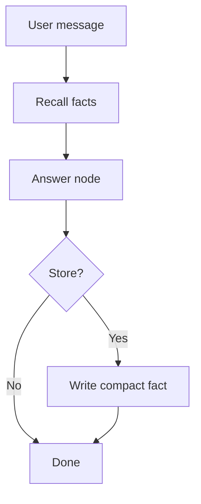

# Long-term memory (store + namespace + key)

-2563eb) 

## Quick take
Long-term memory should store durable facts, not a growing transcript.
Use stable keys (often `user_id`) and namespaces (`prefs`, `profile`, `project:<id>`) to keep memory clean.

## When to use
- Users return later and you need continuity (days/weeks).
- You want personalization from stable facts (preferences, roles, goals).
- You need to keep prompts small while still “remembering” key details.

## Avoid when
- You cannot store user data (policy/regulatory constraints).
- You only need resumability within a session (use checkpointing instead).

## Memory record shape (starter)
```json
{
  "fact": "prefers short answers",
  "source": "user",
  "confidence": "high",
  "updated_at": "..."
}
```

## Flow (minimal)


Notes:
- Recall uses `user_id` + a namespace (example: `("prefs", user_id)`).

## Failure modes
- Storing raw transcripts (symptom: memory is huge and low-signal).
- No curation (symptom: conflicting “facts” accumulate).
- Bad keys/namespaces (symptom: recall returns nothing or wrong user data).

## Checklist (copy/paste)
- [ ] Keying strategy is explicit (typically `user_id` + namespace).
- [ ] Stored memories are compact facts/summaries (not transcripts).
- [ ] Writes are gated (only store when useful; avoid spamming memory).
- [ ] Recall is bounded (top-k, strict fields).
- [ ] Retention/deletion exists for long-term data.

## Links
- Official docs:
  - https://langchain-ai.github.io/langgraph/
- Internal:
  - `patterns/07-context-window-trim-summarize.md`

---
[](../README.md)
[](05-short-term-memory-checkpointers-thread-id.md)
[](07-context-window-trim-summarize.md)
