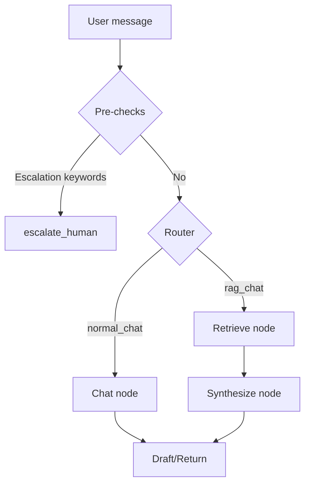

# Multi-node orchestration (state + edges)

 

## Quick take
Multi-node graphs get messy when nodes do multiple jobs and state is undefined.
Keep one shared state contract, single-purpose nodes, and validated conditional edges.

## When to use
- You have stages like route → retrieve → synthesize → draft.
- You want to reuse nodes across multiple workflows.
- You need branching that stays readable (not “spaghetti edges”).

## Avoid when
- One node can answer reliably (no orchestration needed).
- You’re building a framework instead of a focused workflow.

## State contract (starter)
```python
# Conceptual only (shape matters more than exact type)
AgentState = {
  "messages": [...],        # bounded
  "route": "normal_chat",   # enum
  "tool_outputs": {...},    # bounded + structured
  "retrieved_docs": [...],  # bounded
}
```

## Flow (minimal)


## Optional upgrades (when you outgrow the basics)
- Async nodes: use `async` for I/O-heavy steps (web/API/retrieval) so you don’t block.
- Parallel branches: run independent lookups in parallel (example: web search + DB lookup), then merge results back into state.
- Rule: keep the merge predictable (bounded fields, clear precedence) so state doesn’t become “last write wins” chaos.

## Failure modes
- Nodes do multiple jobs (symptom: changes break unrelated behavior).
- State keys drift (symptom: downstream nodes fail in surprising ways).
- Branching uses free text (symptom: invalid routes at runtime).

## Checklist (copy/paste)
- [ ] State is a single shared contract (document keys and bounds).
- [ ] Each node has one job and returns an updated state.
- [ ] Conditional edges branch on validated enums/schemas.
- [ ] Tool execution is a node (tool output → state, bounded).
- [ ] The full workflow fits on one screen (diagram or 5–8 steps).

## Links
- Official docs:
  - https://langchain-ai.github.io/langgraph/
- Internal:
  - `patterns/02-routing-chat-vs-rag-vs-escalation.md`

---
[](../README.md)
[](09-retries-fallbacks-guards.md)
[](../README.md#cookbook-example-milestones)
